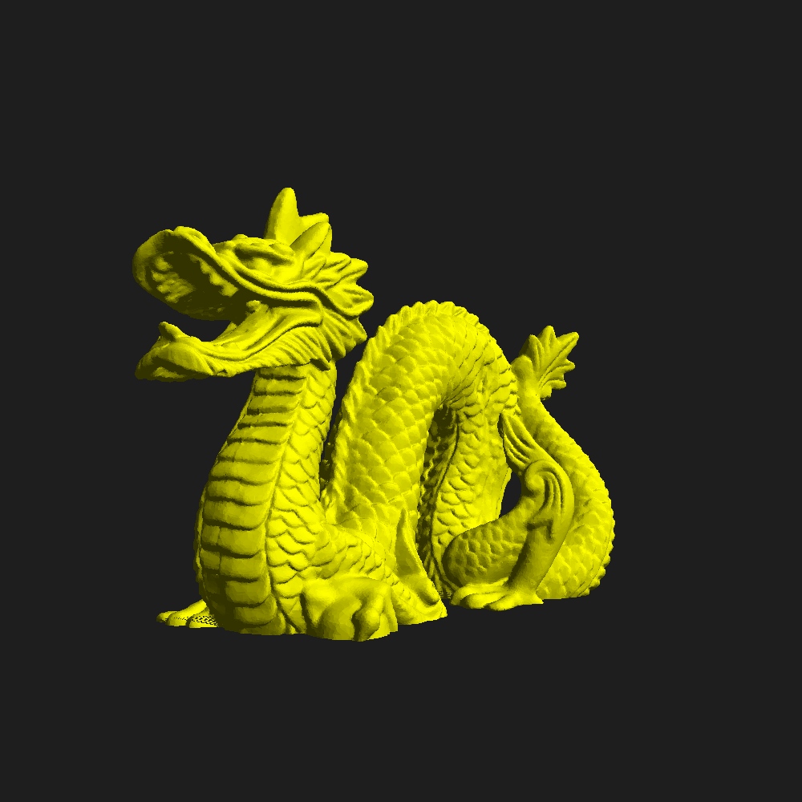

# Pix3D - простой 3D-движок на Go
Простой 3D-движок на Go.
<br><br>
<br><br>
# Обзор
* Поддержка моделей в формате OBJ
* Поддерживает несколько источников света
* Использует CPU

Графика основана на [https://github.com/romanSPB15/pixgl](PixGL)

## Пример кода

```
package main

import (
	"image/color"
	"log"
	"math"

	"github.com/romanSPB15/pix3d"
)

func main() {
	cnv := pix3d.NewCanvas(1000, 1000)
	cnv.Fill(color.RGBA{30, 30, 30, 255})

	tris, err := pix3d.ParseOBJ("stanford-bunny.obj")
	if err != nil {
		log.Fatal(err)
	}

	tris = pix3d.CenterAndScaleModel(tris, 1.0)

	cnv.Scale = 1800

	cnv.DrawModel(tris, pix3d.Yellow)
	cnv.Save("render.png")
}
```
