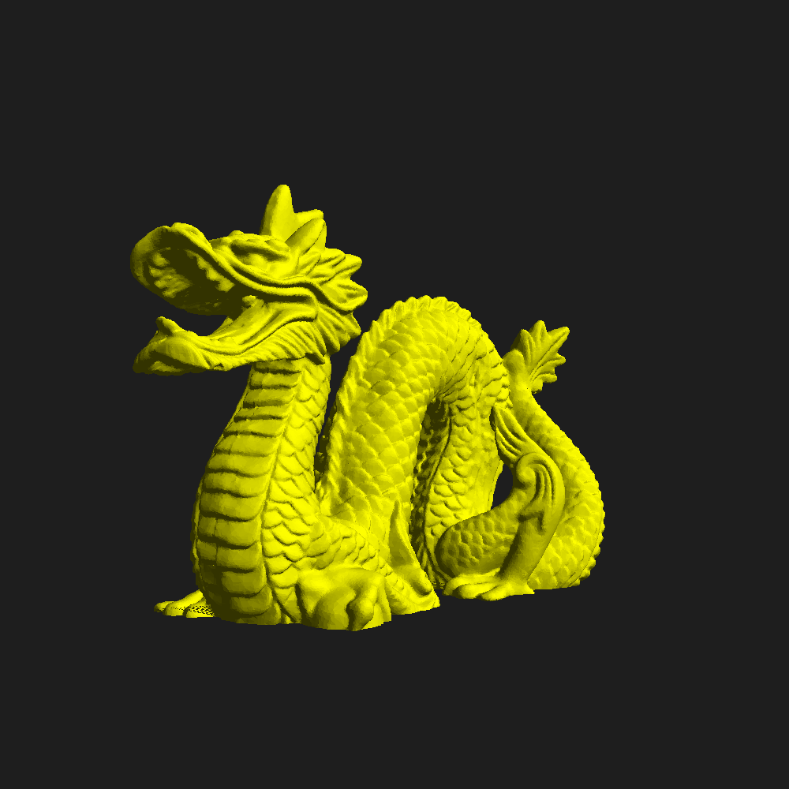

# Pix3D
Легковесный 3D-движок на CPU, написанный на чистом Go.
<br><br>
<br><br>
# Особенности
* Поддерживает текстовый Wavefront OBJ.
* Поддержка нескольких источников света.

## Установка
```bash
go get -u github.com/romanSPB15/pix3d
```

## Быстрый старт

```
package main

import (
	"image/color"
	"log"
	"math"

	"github.com/romanSPB15/pix3d"
)

func main() {
	cnv := pix3d.NewCanvas(1000, 1000)
	cnv.Fill(color.RGBA{30, 30, 30, 255})

	tris, err := pix3d.ParseOBJ("stanford-bunny.obj")
	if err != nil {
		log.Fatal(err)
	}

	tris = pix3d.CenterAndScaleModel(tris, 1.0)

	cnv.Scale = 1800

	cnv.DrawModel(tris, pix3d.Yellow)
	cnv.Save("render.png")
}

```

## Производительность
* На крупных моделях 4.6 млн. тругольников в секунду
* На мелких моделях 3~4 млн.
* В ветке `feature/indexed-geometry` используется индексированная геометрия, так что потребление памяти упало в 3 раза.
* Потребление памяти `feature/indexed-geometry` от 128 байт на треугольник.
> Тесты проводились на разрешении 1000x1000.
> 
## Лицензия
`MIT`
